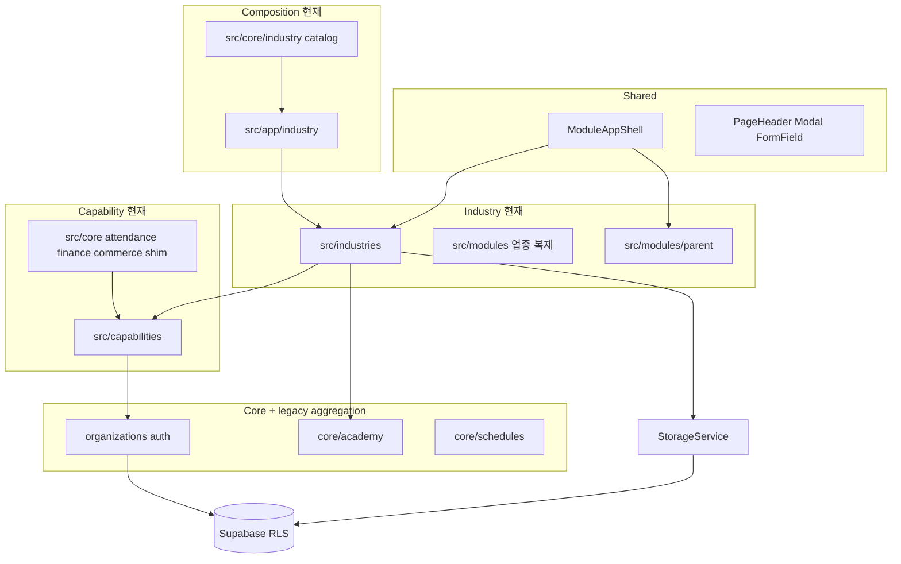
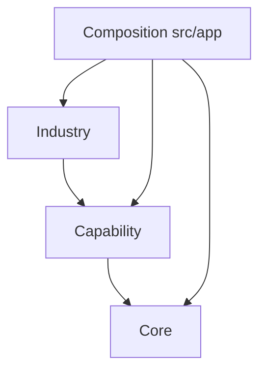

# MOA Architecture 1.0

> 운영 개발 표준. **현재 구현**과 **권장 미래 구조**를 섞어 읽지 않는다.  
> 다중 역할 전환 갭·로드맵: [MOA_MULTI_ROLE_ARCHITECTURE.md](./MOA_MULTI_ROLE_ARCHITECTURE.md)  
> 코딩 규칙: [CODING_STANDARDS.md](./CODING_STANDARDS.md)  
> 계층 계약 요약: [architecture/capability-layers.md](./architecture/capability-layers.md)  
> Cursor 규칙: `.cursor/rules/architecture.mdc`

용어는 [PROJECT_MAP.md](./PROJECT_MAP.md) · [DOMAIN_MAP.md](./DOMAIN_MAP.md) · [DATA_FLOW.md](./DATA_FLOW.md)와 같다.

| 용어 | 의미 |
| --- | --- |
| **Core** | 업종 독립 공통 기반 |
| **Capability** | 여러 업종이 선택하는 업무 기능 |
| **Industry** | 특정 업종의 화면·규칙·조합 |
| **Composition** | definition / manifest / registry / router / loader 조립 |
| **Legacy aggregation layer** | 여러 책임이 한 폴더에 섞인 이행 중 묶음 (`core/academy`, `StorageService`, `src/modules` 업종 복제) |
| **Infrastructure** | persist, hydrate, sync, audit, idempotency, outbox |

---

## 현재 구현

아직 한 구조로 끝나지 않았다. 아래가 **지금 디스크에 있는 사실**이다.

```
src/
├─ core/           # 테넌트·카탈로그 + legacy aggregation + capability shim
├─ modules/        # parent 포털(라이브) + 업종 폴더 잔여 복제
├─ capabilities/   # 선택 업무. 일부는 구현, 일부는 manifest
├─ industries/     # 업종 화면·plugin — 런타임 Industry SoT
├─ app/industry/   # 라우터·로더·모듈 등록 — 런타임 Composition SoT
├─ shared/         # UI / layout / utility
├─ services/       # StorageService + hydrate/sync (Infrastructure, 아직 거대 facade)
├─ hooks/
├─ context/
├─ lib/
└─ utils/
```

| 현재 경로 | 실제 역할 |
| --- | --- |
| `src/core` | Core foundation + **legacy aggregation**(`academy`) + 다수 capability **compat shim** |
| `src/core/industry` | 카탈로그·alias·`definitions`(Core foundation) + pluginHost·Generic shell(**Composition 잔여**). **Industry 구현이 아님**. 라이브 라우터는 `src/app/industry` |
| `src/core/academy` | 학생/학부모/반/시간표/상담/수납 UI가 섞인 **legacy aggregation layer**. 신규 기능의 기본 위치가 아님 |
| `src/modules` | 학부모 포털(`parent`)은 여기. `piano` 등 업종 폴더는 Industry 복제(레거시). 런타임 조립은 `src/industries` |
| `src/services` | StorageService mega-facade + adapters. **제거되지 않음** |
| `src/capabilities` | attendance, billing, commerce, scheduling, booking 등 구현 또는 manifest |
| `src/industries` | piano, pilates, gym, daycare, skin, retail, bath |
| `src/app/industry` | `industryModules.tsx`, `IndustryAppRouter`, `loadIndustryModules` |

장기 Capability 후보가 아직 Core 경로에 남아 있다(구현 또는 shim):  
`src/core/attendance`, `finance`, `commerce`, `resources`, `schedules`, `availability`, `capacity`, `waitlist`, `transport`.

---

## 권장 미래 구조

```
src/
├─ core/                      # 업종을 모르는 기반만
├─ capabilities/<id>/         # 선택 업무 (domain / application / ui / infrastructure)
├─ industries/<id>/           # 업종 전용
├─ app/                       # Composition
├─ shared/
└─ services/infrastructure/   # hydrate/sync. StorageService는 facade로 분해 (아직 미완료)
```

`src/modules/parent`는 학부모 포털로 남길 수 있다. 업종 폴더를 `modules`에 다시 두지 않는다.

---

## 계층 정의

### Core

업종 독립적인 공통 기반. 특정 Industry 구현을 모른다.

예: Auth, Organization, Membership, Authorization, Customer(성인 포털), Staff, Locations, Platform, Audit, Idempotency, Outbox, 업종 카탈로그 조회(`definitions` / alias).

“여러 업종에서 재사용할 수 있을 것 같다”는 이유만으로 Core에 두지 않는다. 업종 무관 기반이면 Core, 여러 업종이 **선택**하는 같은 업무면 Capability.

신규 위치는 [MOA_DEVELOPMENT_STANDARD.md](./MOA_DEVELOPMENT_STANDARD.md) 의사결정 트리. 요약:

| 질문 | 권장 위치 | 현재 주의 |
| --- | --- | --- |
| 업종 무관 기반 | `src/core/<domain>` | `core/academy`에 두지 않음 |
| 여러 업종이 선택하는 같은 업무 | `src/capabilities/<id>` | Core shim을 신규 SoT로 쓰지 않음 |
| 한 업종만 / 업종마다 다름 | `src/industries/<id>` | `src/modules/{piano,…}` 신규 금지 |
| registry / router / loader | `src/app/industry` | `core/industry`는 카탈로그 + Composition 잔여 |

### Capability

여러 Industry가 **선택**하는 업무 기능. Core가 아니다.

예: attendance, scheduling, booking, billing, commerce, parent, resources, transport, roster, enrollment, consultation.

특정 Industry를 import하지 않는다. 업종별 if/else를 Capability에 쌓지 않는다.

### Industry

특정 업종의 화면, 업무 규칙, 도메인 확장.

예: piano, pilates, gym, daycare, skin, retail, bath.

Capability와 Core를 조합할 수 있다.

### Composition

Industry definition / manifest / registry / router / loader를 조립한다. concrete Industry를 알아도 된다.

현재: 카탈로그 정의는 `src/core/industry/definitions.ts`(Core foundation). pluginHost·Generic shell은 같은 폴더의 **Composition 잔여**. 라이브 라우터·모듈 등록은 `src/app/industry` (**Composition SoT**).

### Shared

재사용 UI / layout / utility. 업종 비즈니스 로직 금지.

대표: `ModuleAppShell`, `PageHeader`, `Modal`, `ConfirmDialog`, `FormField`, `density.ts`.

---

## 권장 의존

```text
Composition
  ↓
Industry
  ↓
Capability
  ↓
Core

Composition → Industry     허용
Composition → Capability   허용
Composition → Core         허용
Industry    → Capability   허용
Industry    → Core         허용
Capability  → Core         허용

Core        → Industry     금지
Capability  → Industry     금지
```

검사: `scripts/check-architecture-dependencies.mjs`. LEGACY allowlist는 기존 부채, 신규 위반은 실패.

기존 교차 import (piano→pilates Pass, skin→pilates hubs, parent→daycare/piano)는 이유 없이 삭제하거나 복제하지 않는다.

---

## 계층 다이어그램

### 현재 구현



### 권장 미래



---

## Data Flow

### 현재 구현 (주류 CRUD)

```
Component → StorageService → sync adapters → Supabase
```

예: Income/Expense 일부, ConsultationRecords, Settings. StorageService는 **아직 살아 있다.**

### 이행 중 (도메인 파사드)

```
Component → StudentService | TuitionService | LessonService | ScheduleService
         → StorageService → sync adapters → Supabase
```

### 권장 (신규)

```
Component → Hook → Service → getCoreClient() / RPC → Supabase
```

예: Availability / Reservation — `availabilityService` / `reservationService`.  
성인 포털 — `studentPortalService` / `practiceRoomReservationService` / `customerJoinService`.

### 장기 목표 (아직 전 경로가 아님)

```
Industry UI → Capability Application/Service → Core / Repository / RPC
```

capability `infrastructure/*Storage` facade로 StorageService를 나눌 수 있다. **지금 StorageService를 제거한 상태가 아니다.**

- 신규 UI는 파사드 Service를 호출한다. 컴포넌트에서 `StorageService`를 필수 진입점으로 쓰지 않는다.
- 파사드 내부 Storage 동기화는 일괄 제거 금지.
- UI에서 supabase 직접 호출 금지.
- 동작 중인 RPC를 Command Executor로 재작성하지 않는다. 파일럿: `reservation.confirm` (테스트 전용).

상세: [DATA_FLOW.md](./DATA_FLOW.md).

---

## 신규 기능 / 새 Industry 절차

일반:

```text
Requirement
  → Domain classification
  → Core / Capability / Industry / Composition 결정
  → Authorization
  → Persistence
  → Service
  → UI
  → Test
```

새 Industry (기존 Core/Capability 구현 수정 ≈ 0):

```text
Industry definition          src/core/industry/definitions.ts
  → Capability 조합          기존 capability만 선택. industry if/else 금지
  → Industry-specific 구현   src/industries/<id> (plugin, UI, service)
  → Contract test            test:industry-contract
  → Composition registration src/app/industry/industryModules.tsx
  → Regression test          test:business-invariants, persist/hydrate
```

StorageService에 업종 slice를 무조건 추가하지 않는다. Capability에 업종 분기를 넣지 않는다.

---

## 도메인 표준 (2026-09 추가)

### 성인 수강생 (Adult / Customer portal)

| 항목 | 규칙 |
|---|---|
| Identity | `core.students.user_id` = auth user (self-link). CRM은 `core.customers` + `student_enrollments.customer_id` |
| 셸 | `CustomerShell` — 보호자 포털(`ParentShell`)과 분리. PIN 출석 대신 본인 출석·이용권·연습실 |
| 가입 | `customer_join_requests` → `approve_customer_join_request` (성인 승인 시 students.user_id 연결) |
| Service | `studentPortalService`, `customerJoinService` → `getCoreClient()` |

### 연습실 대여 (Practice rooms)

| 항목 | 규칙 |
|---|---|
| Canonical DB | `core.practice_rooms` + `core.room_reservations` (+ EXCLUDE 충돌) |
| 고객 UI | `CustomerPracticeRoomView` → `practiceRoomReservationService` (신청 → pending → 원장 승인) |
| 스태프 UI | `PracticeRoomBookingView` → `create_staff_room_reservation` / `listByDate` (canonical만) |
| 금지 | 고객·스태프가 서로 다른 테이블에만 쓰고 충돌 검사를 건너뛰는 신규 플로우. 레거시 `schedules.metadata.kind=practice_room` **신규 쓰기 금지** (읽기 폴백만) |

### 수강료 청구·수기 정산 (Manual billing, No PG)

| 항목 | 규칙 |
|---|---|
| 청구서 | 앱 `TuitionInvoice` ↔ `core.payments` (`sent_at`, metadata.invoiceSent) |
| 수기 결제 | 앱 `TuitionPayment` ↔ `core.payment_transactions` (`local_currency` / `onsite_card` / cash / transfer, `cash_receipt_issued`) |
| 발송 | **수동만**. 초안 생성(`invoiceSent=false`) ≠ 발송. `TuitionService.sendInvoice` / 일괄 발송에서만 알림 |
| PG | **비도입**. Toss/Stripe 자동 카드 결제는 로드맵에서 보류. 학원 현장·상품권·이체 수기 완납이 기본 |
| 학부모 | 발송된 청구만 조회. 계좌 안내·현금영수증 요청(`request_payment_cash_receipt` + 로컬 캐시) |
| UI | `TuitionService` 파사드. 신규 모달은 shared `Modal` 우선 |

상세 로드맵·갭: [MOA_MULTI_ROLE_ARCHITECTURE.md](./MOA_MULTI_ROLE_ARCHITECTURE.md) Phase 3A.  
피아노 납품·파일럿 검수: [PIANO_DELIVERY_CHECKLIST.md](./PIANO_DELIVERY_CHECKLIST.md).

---

## 멀티테넌트 데이터 규칙

### 개념 분리

| 개념 | 의미 |
|---|---|
| User | 개인 identity (로그인) |
| Organization | 사업장 / 테넌트 |
| OrganizationMembership | 조직 내 역할·권한 |
| Customer | 특정 Organization과의 고객 관계 |

```
User → OrganizationMembership → Organization
User → Customer relationship → Organization
```

로그인 여부와 조직 권한을 동일한 개념으로 취급하지 않는다.

### 격리 규칙

1. 조직 데이터는 `organization_id` 기준으로 격리한다.
2. 모든 신규 DB 조회/저장/수정은 organization scope를 명확히 한다.
3. RLS가 있어도 애플리케이션에서 organization context를 유지한다 (`OrganizationProvider`, `useOrganization`).
4. 다른 organization 데이터가 노출될 수 있는 전역 조회를 신규로 만들지 않는다.
5. 활성 조직 전환은 membership/context API를 통한다 (직접 로컬 키만으로 권한을 가정하지 않음).
6. 지점 범위는 `location_id`로 확장한다. 테넌트 경계를 대체하지 않으며 기존 테이블에 일괄 추가하지 않는다. 상세: [location-aware-domains.md](./architecture/location-aware-domains.md).

다중 역할·Guardian/Student 글로벌 모델 전환 상세: [MOA_MULTI_ROLE_ARCHITECTURE.md](./MOA_MULTI_ROLE_ARCHITECTURE.md).

---

## UI 셸

업종 앱은 `ModuleAppShell`로 Header / Sidebar / main / BottomNav / Toast / Confirm을 표준화한다.

페이지 패턴: [PAGE_PATTERNS.md](./PAGE_PATTERNS.md).  
컴포넌트: [UI_COMPONENT_GUIDE.md](./UI_COMPONENT_GUIDE.md).

---

## 문서 역할

| 문서 | 역할 |
|---|---|
| ARCHITECTURE.md (본 문서) | 현재 vs 권장 계층, 멀티테넌트 표준 |
| PROJECT_MAP.md | 폴더 지도 + 장기 이동 방향 |
| DOMAIN_MAP.md | 업무 개념 + 계층 분류 |
| DATA_FLOW.md | 현재 실행 경로 + 장기 흐름 |
| location-aware-domains.md | organization vs location |
| MOA_MULTI_ROLE_ARCHITECTURE.md | 다중 역할 갭·로드맵 |
| UI_ARCHITECTURE_AUDIT.md | 실측 감사 |
| CODING_STANDARDS.md | 일상 코딩 규칙 |
| UI_COMPONENT_GUIDE.md | Shared 컴포넌트 |
| PAGE_PATTERNS.md | 화면·IA 패턴 |
| MOBILE.md / ENV_SETUP.md | 배포·환경 |
