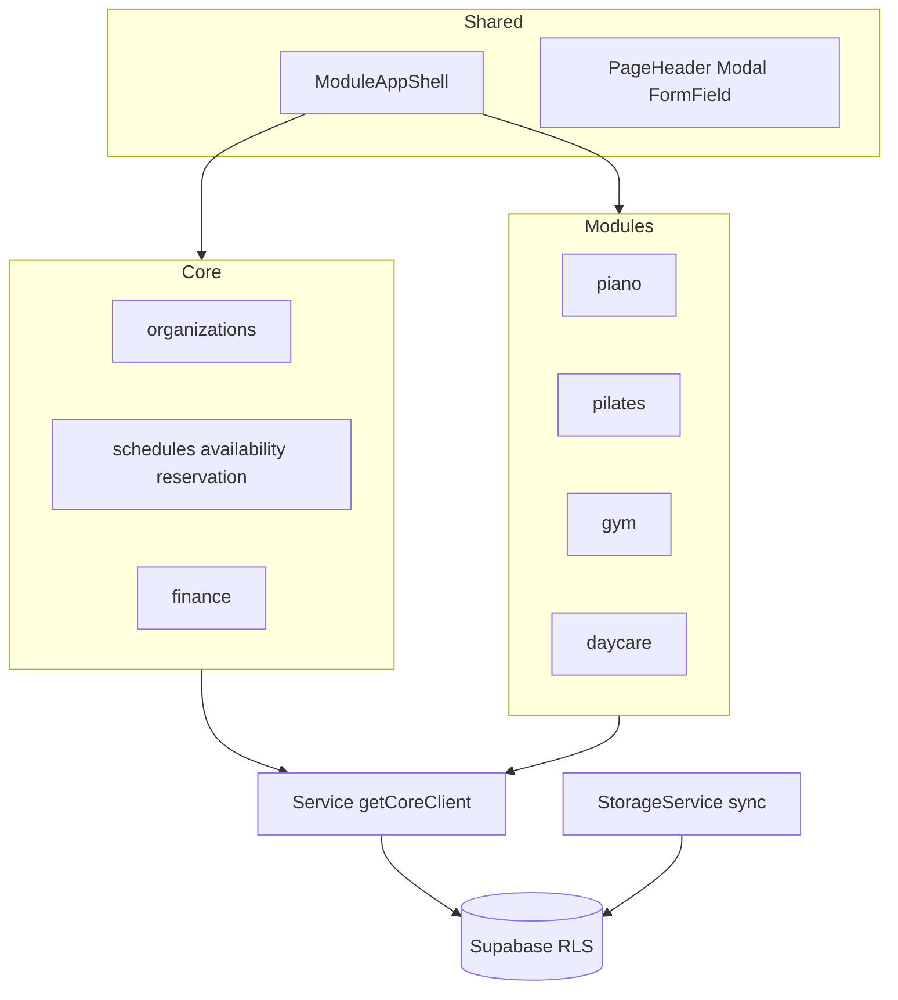

# MOA Architecture 1.0

> 운영 개발 표준 (Core / Module / Shared / Data / Multi-tenant).  
> 다중 역할 전환 갭·로드맵은 [MOA_MULTI_ROLE_ARCHITECTURE.md](./MOA_MULTI_ROLE_ARCHITECTURE.md)를 본다.  
> 코딩 규칙 요약: [CODING_STANDARDS.md](./CODING_STANDARDS.md)

---

## 디렉터리 책임

```
src/
├─ core/       # 여러 업종에서 동일한 의미의 비즈니스
├─ modules/    # 업종별 의미·표현이 다른 비즈니스 (piano, pilates, gym, daycare, parent)
├─ shared/     # UI / layout / utility (업종 비즈니스 로직 금지)
├─ services/   # StorageService 등 레거시·공통 서비스
├─ hooks/      # 공용 React hooks
├─ context/    # AppContext 등
├─ lib/        # supabase client, 인프라
└─ utils/      # 순수 유틸
```

### Core

여러 업종에서 **동일한 의미와 동일한 책임**을 가지는 비즈니스 기능.

예: Auth, Organization, Membership, Customer, Schedule, Availability, Reservation, Consultation, Notification, Finance 공통 기반, Attendance(옵션), Transport 등.

### Module

업종에 따라 의미가 달라지는 비즈니스 로직.

| Module | 예 |
|---|---|
| Piano | 학생·정규 레슨·교재·진도·연습·발표회 |
| Pilates | 그룹 수업·이용권·잔여 횟수·대기 |
| Beauty (향후) | 서비스·패키지·이용권 차감·시술 기록 |
| Daycare | 보육 일지·투약 등 |
| Parent | 학부모 포털 UX (업종별 홈 표현) |

중요: “여러 업종에서 재사용할 수 있을 것 같다”는 이유만으로 Core로 이동하지 않는다. **동일한 의미·동일한 책임**인지 먼저 판단한다.

### Shared

재사용 가능한 UI / layout / utility. 업종 비즈니스 로직을 넣지 않는다.

대표: `ModuleAppShell`, `PageHeader`, `Modal`, `ConfirmDialog`, `FormField`, `density.ts`.

---

## 계층 다이어그램



---

## Data Flow

### 권장 (신규)

```
Component → Hook → Service → getCoreClient() → Supabase
```

예: Availability / Reservation — `availabilityService` / `reservationService`.

### 레거시 (현행 주류 CRUD)

```
Component → StorageService → sync adapters → Supabase
```

예: Students, Tuition notes, Income/Expense, ConsultationRecords.

- 신규 실시간·조직 스코프 기능은 Service 경로.
- 레거시는 기능 수정 시 점진 정렬. 일괄 제거 금지.
- UI에서 supabase 직접 호출은 하지 않는다.

---

## 멀티테넌트 데이터 규칙

### 개념 분리

| 개념 | 의미 |
|---|---|
| User | 개인 identity (로그인) |
| Organization | 사업장 / 테넌트 |
| OrganizationMembership | 조직 내 역할·권한 |
| Customer | 특정 Organization과의 고객 관계 |

```
User → OrganizationMembership → Organization
User → Customer relationship → Organization
```

로그인 여부와 조직 권한을 동일한 개념으로 취급하지 않는다.

### 격리 규칙

1. 조직 데이터는 `organization_id` 기준으로 격리한다.
2. 모든 신규 DB 조회/저장/수정은 organization scope를 명확히 한다.
3. RLS가 있어도 애플리케이션에서 organization context를 유지한다 (`OrganizationProvider`, `useOrganization`).
4. 다른 organization 데이터가 노출될 수 있는 전역 조회를 신규로 만들지 않는다.
5. 활성 조직 전환은 membership/context API를 통한다 (직접 로컬 키만으로 권한을 가정하지 않음).

다중 역할·Guardian/Student 글로벌 모델 전환 상세: [MOA_MULTI_ROLE_ARCHITECTURE.md](./MOA_MULTI_ROLE_ARCHITECTURE.md).

---

## UI 셸

업종 앱은 `ModuleAppShell`로 Header / Sidebar / main / BottomNav / Toast / Confirm을 표준화한다.

페이지 패턴: [PAGE_PATTERNS.md](./PAGE_PATTERNS.md).  
컴포넌트: [UI_COMPONENT_GUIDE.md](./UI_COMPONENT_GUIDE.md).

---

## 문서 역할

| 문서 | 역할 |
|---|---|
| ARCHITECTURE.md (본 문서) | 일상 아키텍처·멀티테넌트 표준 |
| MOA_MULTI_ROLE_ARCHITECTURE.md | 다중 역할 갭 분석·로드맵 |
| UI_ARCHITECTURE_AUDIT.md | 실측 감사·Gap·정리 후보 |
| CODING_STANDARDS.md | 일상 코딩 규칙 |
| UI_COMPONENT_GUIDE.md | Shared 컴포넌트 사용 |
| PAGE_PATTERNS.md | 화면·IA 패턴 |
| MOBILE.md / ENV_SETUP.md | 배포·환경 (본 표준과 별개) |
